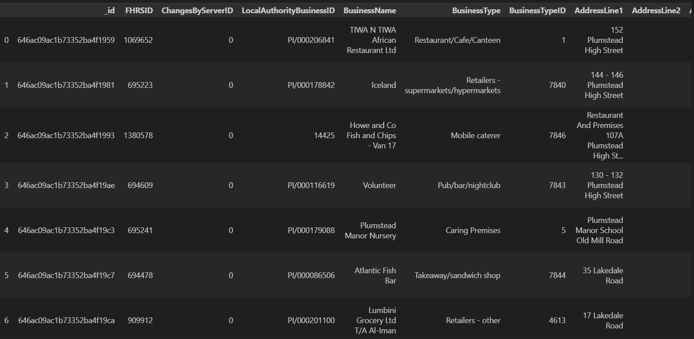

# nosql-challenge
## `NoSQL_setup.ipynb`
```
{'AddressLine1': 'East Cliff Pavilion',
 'AddressLine2': 'Wear Bay Road',
 'AddressLine3': 'Folkestone',
 'AddressLine4': 'Kent',
 'BusinessName': 'The Pavilion',
 'BusinessType': 'Restaurant/Cafe/Canteen',
 'BusinessTypeID': 1,
 'ChangesByServerID': 0,
 'Distance': 4591.765489457773,
 'FHRSID': 1043695,
 'LocalAuthorityBusinessID': 'PI/000073616',
 'LocalAuthorityCode': '188',
 'LocalAuthorityEmailAddress': 'foodteam@folkestone-hythe.gov.uk',
 'LocalAuthorityName': 'Folkestone and Hythe',
 'LocalAuthorityWebSite': 'http://www.folkestone-hythe.gov.uk',
 'NewRatingPending': False,
 'Phone': '',
 'PostCode': 'CT19 6BL',
 'RatingDate': '2018-04-04T00:00:00',
 'RatingKey': 'fhrs_5_en-gb',
 'RatingValue': 5,
 'RightToReply': '',
 'SchemeType': 'FHRS',
 '_id': ObjectId('646ac099c1b73352ba4ea61d'),
 'geocode': {'latitude': 51.083812, 'longitude': 1.195625},
...
          'returncode': None,
          'totalCount': 0,
          'totalPages': 0},
 'scores': {'ConfidenceInManagement': 5, 'Hygiene': 5, 'Structural': 5}}
 ```

 ## `NoSQL_analysis.ipynb`
### Dataframes



